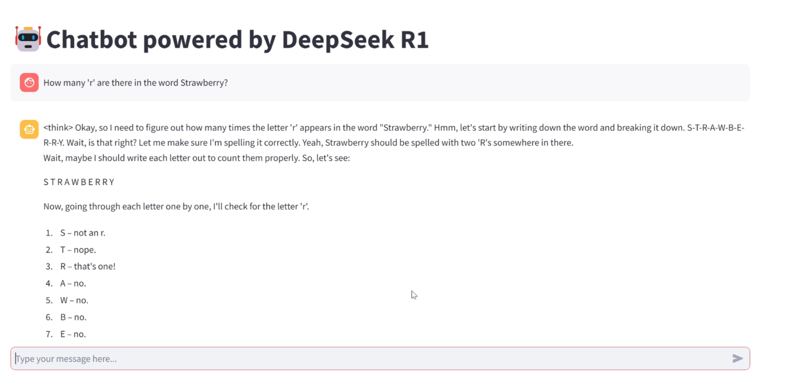

# DeepSeek R1 Chatbot

DeepSeek R1 Chatbot is a conversational AI application built with Streamlit, LangChain, and the Ollama model. This chatbot provides an intuitive interface for interactive conversations, preserving chat history, and generating detailed responses from the DeepSeek R1 LLM (Large Language Model).

Below is an image of the interface:




---

## Features

- **Interactive Chat Interface**: User-friendly, conversational design utilizing Streamlit's `st.chat_message` API.
- **Logical Chunking of Responses**: Ensures responses are broken into logical sections (e.g., paragraphs, code blocks) for clarity.
- **Session Persistence**: Chat history is stored in `st.session_state` to maintain continuity across user interactions.
- **Code-Friendly Output**: Properly handles code blocks to ensure they are not split or cut off.
- **Seamless Integration with LLM**: Uses LangChain and Ollama for efficient communication with the DeepSeek R1 model.

---

## Demo

A demo video of the application is available: [DeepSeek R1 Chatbot Demo](https://drive.google.com/file/d/1_oQgtOoI0Nk2ONDNUnwxvww9JnDWphWv/view?usp=sharing).

---

## Installation

### Prerequisites

- Python 3.8 or higher
- Streamlit
- LangChain
- Ollama installed and running locally

### Setup Steps

1. Clone the repository:
   ```bash
   git clone https://github.com/abhishekumarsingh785/deepseekr1-chatbot.git
   cd deepseekr1-chatbot
   ```
2. Create and activate a virtual environment
   ```bash
   python -m venv venv
   source venv\Scripts\activate
   ```
3. Install dependencies
   ```bash
   pip install -r requirements.txt
   ```
4. Ensure the Ollama model is running locally. Start the DeepSeek R1 model
   ```bash
   ollama run deepseek-r1:8b
   ```
5. Run the Streamlit app
   ```bash
   streamlit run app.py
   ```
### Usage
1. Open the app in your browser (usually at http://localhost:8501).
2. Type your message in the input box at the bottom of the page.
3. The chatbot responds in real-time, with user and assistant messages displayed in a conversational format.


